# Welcome Home!

This guide will hopefully help answer any questions in our somewhat high-tech household.

# Table of Contents

- [Welcome Home!](#welcome-home)
- [Table of Contents](#table-of-contents)
- [Outside](#outside)
  - [Neighborhood](#neighborhood)
  - [Doors, Gates, Locks](#doors-gates-locks)
  - [Trash Pickup](#trash-pickup)
  - [Hot Tub](#hot-tub)
  - [BBQ](#bbq)
  - [Lawn Mowers](#lawn-mowers)
- [Inside](#inside)
  - [Internet / Wifi](#internet--wifi)
  - [Tablets](#tablets)
  - [Heating](#heating)
  - [Kitchen](#kitchen)
    - [Coffee Machine](#coffee-machine)
    - [Exhaust Fan](#exhaust-fan)
  - [Lights](#lights)
  - [Music System](#music-system)
  - [Sauna](#sauna)
  - [Vacuums](#vacuums)
  - [TVs](#tvs)
  - [Projector](#projector)
  - [Fuse Box](#fuse-box)
  - [Trash sorting](#trash-sorting)
- [Dogs](#dogs)
  - [Bowser](#bowser)
    - [Special Needs](#special-needs)
  - [Peach](#peach)

# Outside

## Neighborhood

Syrenparken is a fairly quiet street with mostly small families and some middle-aged inhabitants. It is a safe and peaceful place.

Snejbjerg is a suberb of Herning city with enough shops/supermarkets to supplies. It is also on the edge of farmland so there are agricultural supplies as well.

Many restaurants in Herning wil gladly deliver to Snejbjerg, including pizza, burgers, sushi, and even bubble tea. Herning is about 5 kilometers east and can be reached by public transit (bus).

## Doors, Gates, Locks

Info about locking and unlocking our various ports.

- [House Doors](./doors.md#doors)
- [Garage Doors](./doors.md#garage-doors)
- [Gate](./doors.md#gate)
- [Shed doors](./doors.md#shed-doors)

The property is completely enclosed by walls, gates, and fences - this makes it safe for the dogs to run around without escaping.
Additionally, we've fenced off an area of "backyard" within our yard where the dogs can go outside in a more controlled environment for convenience.

## Trash Pickup

Trash ("restaffald" and "mad") is collected every two weeks on Thursday Morning.
Recycling (the other bin) is collected every four weeks at the same time.

Remember to leave the gate open the night before so the trash crew can access the bins.

## Hot Tub

The tub is labeled and fairly self explanatory. The main thing to take note of is that the safety drainage can not keep up with water flow, so it is up to you to watch the tub and ensure it doesn't overflow.

## BBQ

This is a gas-powered grill with 4 burners (though we've only ever used 3 of them).

Ensure the gas connector is securely fastened to the gas cannister (the flow valve won't open if it isn't).

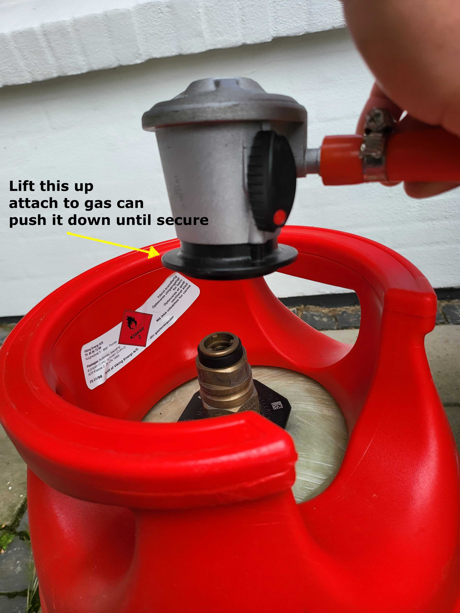

Open the flow valve, hold down the ignition button on the grill (it will click repeatedly) and turn on the ranges. In my experience it can take 5-10 seconds to light.

The range dials would make you think you can adjust the heat continuously between high and low. In practice, almost all positions of the dial will result in very high heat (except when it's close to off, around the 3:00 position).

## Lawn Mowers

The Lawn Mowers run nightly and are automatic. While they don't require any techincal maintenance, they will often end up stuck in a ditch or corner. If you find them stuck somwhere in the morning, please bring them back to their chargers and turn them on (you'll receive the pin code in a DM from us).

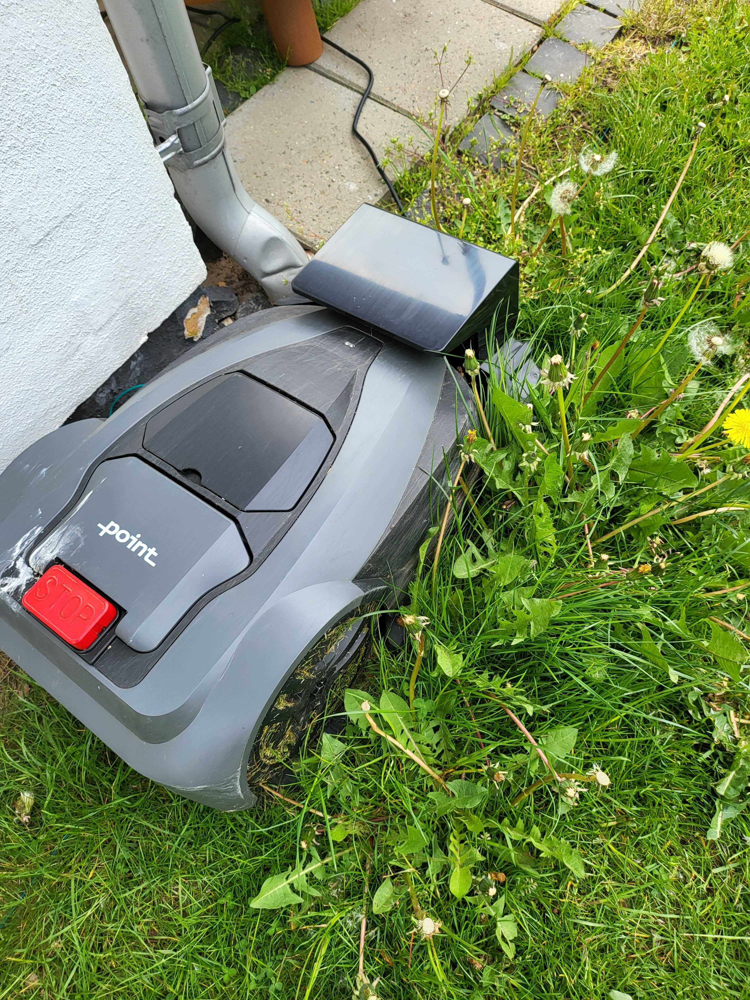

# Inside

## Internet / Wifi

Our network is DontPeek, and there is a 5g and 2.4g variant (the latter is called "DontPeek (slowbro edition)". It's not actually slower in my experience). 
All of the smart devices are on the 2.4g network (slowbro), so I recommend using the 5g if possible to avoid crowding the bandwidth.

The house uses Fiber internet. The Fiber and Router are in the utility closet at the top. There are wifi extenders around the house.

**Please be careful with the shelf - it is very easy to make it fall** and annoying to untangle the cables when it does. Try not to touch the shelf directly if possible.

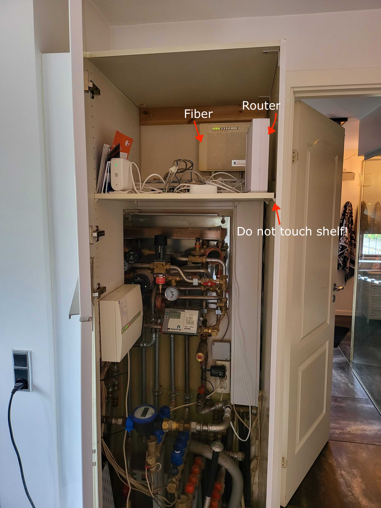

## Tablets

There are two tablets installed in the house: one at the root of the stairs, and one outside of the fusebox alcove.

These are both fully functional tablets - you can use them to browse the internet or watch videos if you want. The reason they are mounted on the walls
is because they have the essential house apps already installed and configured:

- Hue to control the lights (each tablet already set to the right floor)
- Ecovacs to control the vacuums
- Sonos to control the music (each tablet already set to a reasonable set of speakers)

You can double tap the tablets to wake them. They aren't the fastest to wake so you may need to try a few times.

## Heating

The ground floor has floor heating installed in every room. Upstairs there is floor heating in the Game Room and the bathroom.
The other rooms have an area heater with a dial directly on the device for control. 

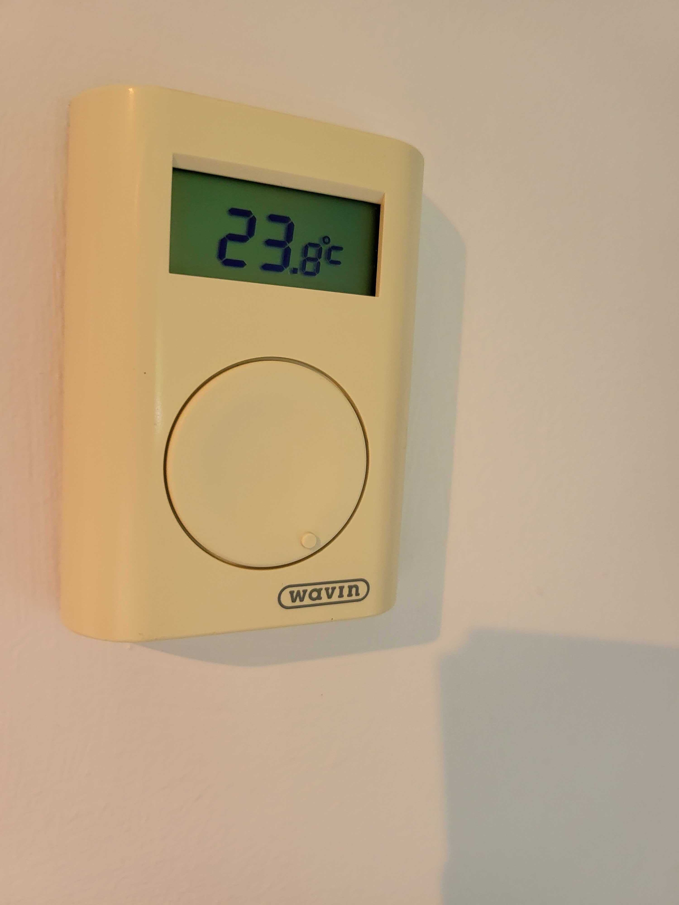

## Kitchen
### Coffee Machine

To refill beans or water, press the 'eject' button and pull the machine out. The water reservoire is on the left and the bean reservoire is on the top.
**Note that you may need to press it again before pushing the machine back in**.

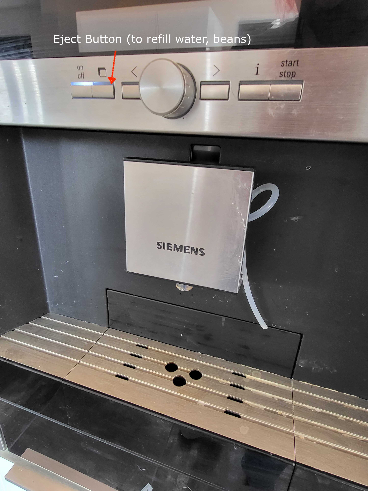

The machine is quite intuitive except when making milk-based drinks (lattes etc.). There are several things to keep in mind:

- You need to use the milk reservoire (normally in the fridge)
- Use 1.5% milk ("letmælk")
- Smell the milk before making a latte - it goes bad faster in the reservoire for some reason
- If the milk is going bad, the cream on the latte will take on a chalky consistency. You'll notice right away - but you can also avoid this by smelling the milk before use.
- Clean the milk hose before use - it gets clogged almost after every use. Do this by squeezing the hose and pushing debris out of the end

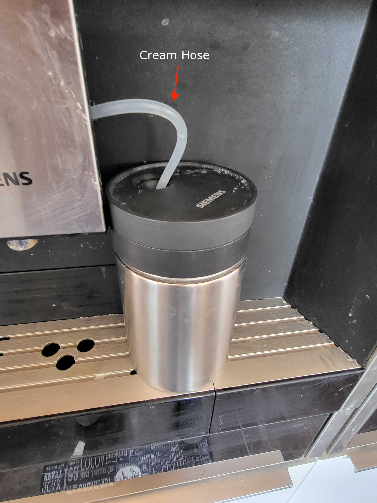

### Exhaust Fan

When frying, please use the exhaust fan. There is a button on the very right side - hold this for a few seconds and the fan will open. Hold it again to close.

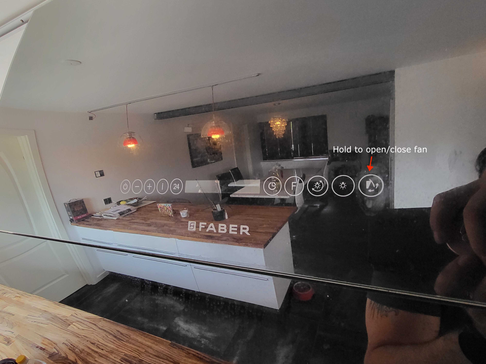

## Lights

Most of our lights are Hue lights. There are a few things to know to get the most out of them.

- [Info about our light switches](./lights.md#manual-control)
- [How to connect to our lights](./lights.md#app)

## Music System

There are Sonos speakers installed in many rooms. You can connect to them and control them via the Sonos app, or just use the tablets on the walls.

## Sauna

There are two dials on the Sauna Oven: Time and Heat. The Time dial is a countdown timer which turns the Sauna on. The Heat dial controls the heat - but note that the max heat is near the 6:00 position despite what the label says. 

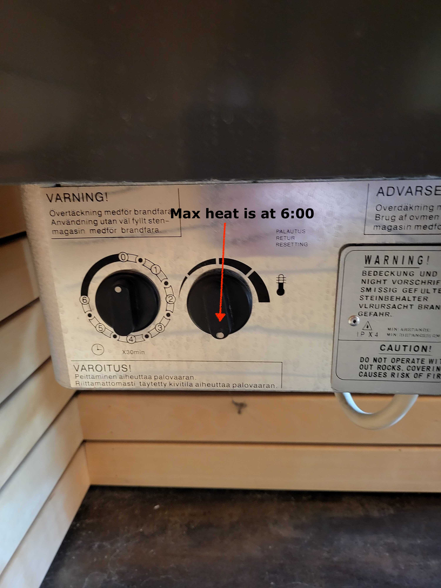

The Sauna doesn't get terribly hot (only 50-60°C max), but with enough humidity you'll certainly sweat. Use the bucket and spoon to pour water gently on the rocks as they heat up. **Do not touch the rocks** - "hot" is an understatement.

## Vacuums

We have two robot vacuums: Wooster (downstairs) and Mrs. Piggleswurt (upstairs). They run daily at 15:30 and their cycle time
will vary dramatically depending on which doors you leave open (it can be anywhere from 30 minutes to several hours).

They can get clogged if they run over e.g. dog toys or loose clothing articles - you can pick them up and clear out any debris, then press the button to restart them.

You are welcome to alter or disable their schedule, however we _highly_ recommend they run daily as the dogs otherwise produce a ton of fur and lint.

**Make sure there is no dog poop on the floor when they're running**. We've lost a vacuum that way. It's a rare occurrence that either dog will poo inside the house, but it's very important to be sure the house is clear of dog poo when the vacuums are running (part of the reason they run at 15:30 is because we found accidents are more likely to happen in the morning or early afternoon).

## TVs

There are many TVs in the house. All of the following have chromecast (so you can cast from your phone):

- Guest Room
- Crafting Room
- Main Bedroom
- Living Room

The Spa bathroom has an Amazon Firestick (the TV and Firestick remotes are next to the tub).

The TV in the main living room is extremely heavy. Though it seems securely mounted, we would advise caution to avoid bumping it if possible (there also shouldn't be a reason to touch it directly, as it has exposed HDMI cables via the cable closet and can be controlled via remote).

## Projector

The projector takes a moment to warm up and works best in darker environments. 

Please note that the projector is connected to an HDMI matrix in order to route the sound to a Sonos system. The HDMI matrix is a bit complex to configure, so best to avoid pressing any buttons on it or its remote, if possible.

## Fuse Box

The fuses are only partially labelled - feel free to shut down the mains (bottom switches) if there is a problem.
Note that there is one switch which seems to control the entire outside and part of the upstairs circuit. It hasn't been a problem, but it's an odd design choice.

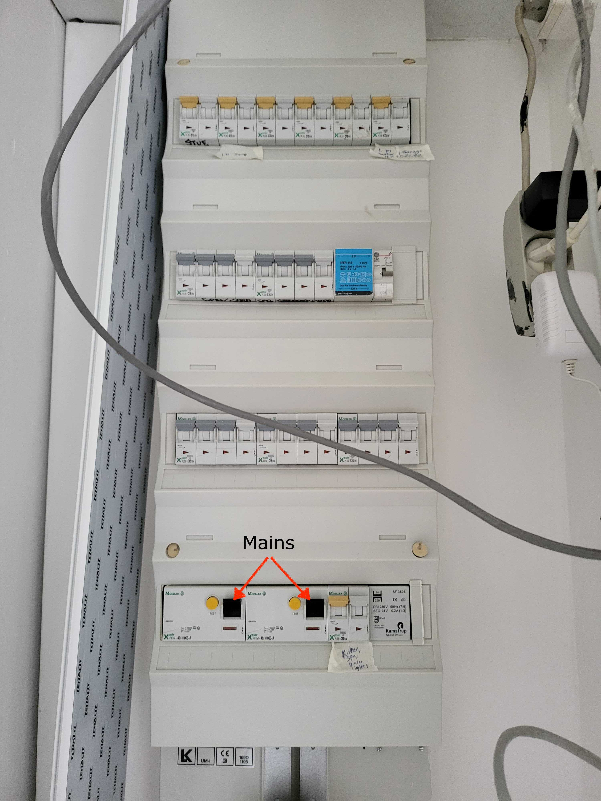

## Trash sorting

In Denmark recycling is quite detailed. In our house bins we separate Paper+Cardboard, Plastic+Metal, Glass, General Trash, and Compost.
There is a bag for the latter under the sink (because of the odor) and a compostor in the back yard.

# Dogs

The dog food is in the rec room closet. They are good at self-regulating their feed, so please just keep the food and water bowls full. The water bowl will need to be washed a few times a day (ideally whenever refilling) as Bowser kind of slobbers into it while he's drinking from it. They can share a water bowl but keep separate food bowls.

Both dogs know "Sit", "Down", "Stay", "Speak" and "Paw". Peach is more likely to respond when she can see a treat.

## Bowser

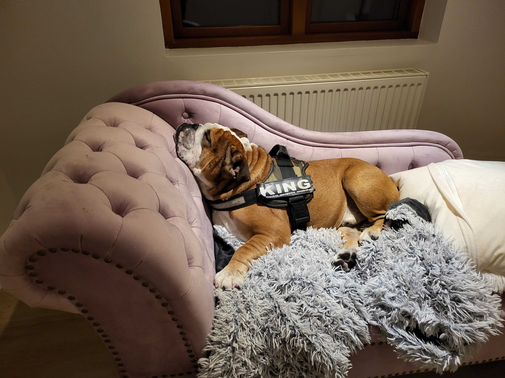

|||
|-|-|
|Breed|English Bulldog|
|Age|4 years|
|Gender|Male|
|Demeanor|Passive, Attention-oriented|

Bowser is a fairly typical bulldog: sleepy most of the time, loud snoring and snorting, and short bursts of energy throughout the day. He'll bark at the door when he needs to go out or if he wants to play/go for a walk (or if he sees anything large moving, like the hammock). His walks should be kept fairly short so as not to overheat him.

In terms of playing, he most enjoys cardboard boxes (in fact, it's pretty much the only thing he plays with). He'll tear boxes apart and play tug of war with Peach. He will also get very excited at certain sounds: the rattling of dice, the jingling of keys, and the air hockey puck.

He enjoys treats but isn't great with crunchy/large treats. He will on occassion vomit after consuming too quickly (true of both treats, food, and water).

### Special Needs

As an English bulldog, Bowser has a lot of wrinkles and needs more cleaning. You can use a wet wipe to clean between his wrinkles and toes.
He is prone to licking his paws to the point of redness and should be scolded when you catch him doing this (you can snap your fingers or clap to discourage him).

His ears (particularly his left) tends to get waxy and can use cleaning via cutip ("vatpinde" in danish) once every few days.

He dislikes showers but will tolerate them and needs them ideally 2x/week.

## Peach

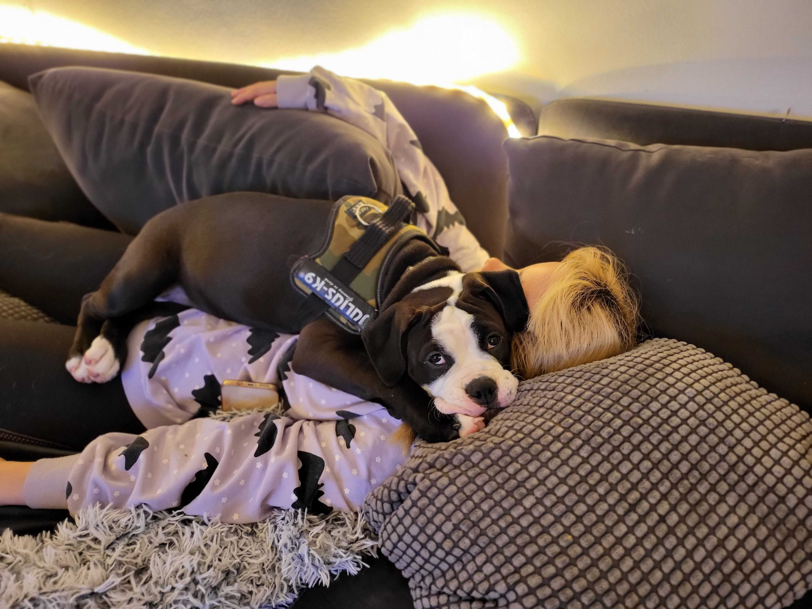

|||
|-|-|
|Breed|Olde English Bulldogge|
|Age|11 Months|
|Gender|Female|
|Demeanor|Energetic, Jealous, Food-oriented|

Peach is still in the late puppy-phase and is very excitable. She's a bit jealous and will try to steal treats and attention away from Bowser. She has some guard-dog instincts and will bark at noises, neighbors or other movement outside - you can tell she's in 'guard mode' when the fur on her back stands up. She doesn't become aggressive beyond barking and will often transition to excitement (which sometimes leads to peeing by accident). When coming home from an outing, it's best to let her out immediately as does pee from excitement. 

She needs to go out several times a day and may indicate by whining or standing near the door, but she doesn't have a lot of patience and can hav accidents if not let out regularly.

