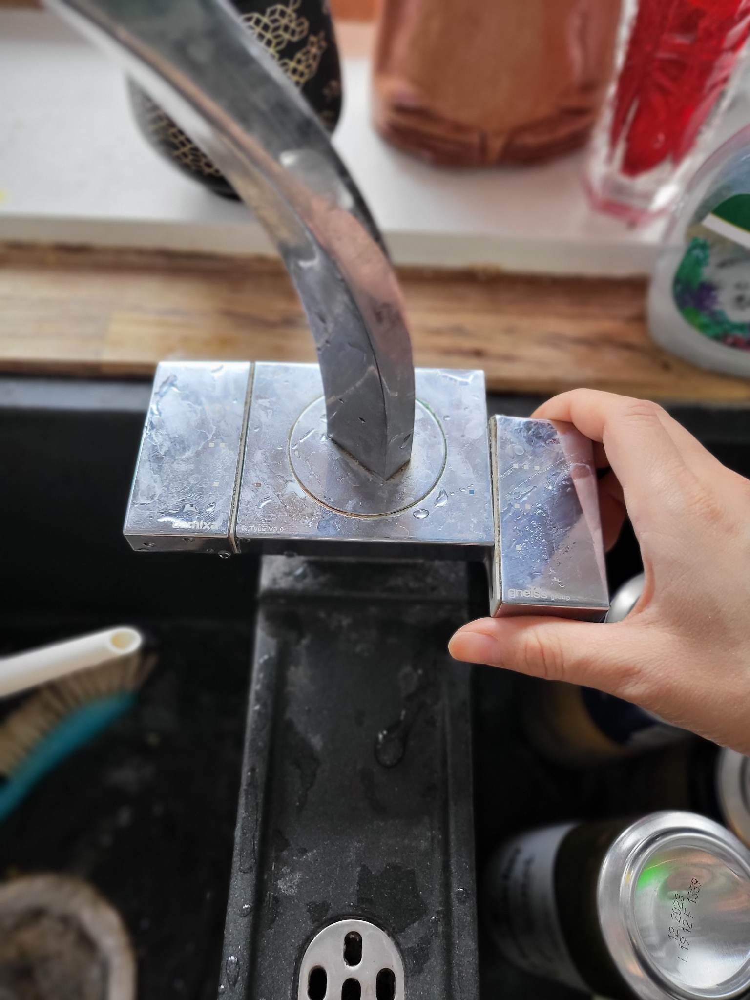

# Welcome Home!

This guide will hopefully help answer any questions in our somewhat high-tech household.

# Table of Contents

- [Welcome Home!](#welcome-home)
- [Table of Contents](#table-of-contents)
- [Outside](#outside)
  - [Neighborhood](#neighborhood)
  - [Doors, Gates, Locks](#doors-gates-locks)
  - [Trash Pickup](#trash-pickup)
  - [Hot Tub](#hot-tub)
  - [BBQ](#bbq)
  - [Lawn Mowers](#lawn-mowers)
- [Inside](#inside)
  - [Security System](#security-system)
  - [Internet / Wifi](#internet--wifi)
  - [Tablets](#tablets)
  - [Heating](#heating)
  - [Kitchen](#kitchen)
    - [Coffee Machine](#coffee-machine)
    - [Exhaust Fan](#exhaust-fan)
  - [Lights](#lights)
  - [Music System](#music-system)
  - [Sauna](#sauna)
  - [Showers](#showers)
  - [Vacuums](#vacuums)
  - [TVs](#tvs)
  - [Projector](#projector)
  - [Fuse Box](#fuse-box)
  - [Trash sorting](#trash-sorting)
- [Dogs](#dogs)
  - [Bowser](#bowser)
    - [Special Needs](#special-needs)
  - [Peach](#peach)
    - [Special Needs](#special-needs-1)

# Outside

## Neighborhood

Syrenparken is a fairly quiet street with mostly small families and some middle-aged inhabitants. It is a safe and peaceful place.

Snejbjerg is a suberb of Herning city with enough shops/supermarkets to supplies. It is also on the edge of farmland so there are agricultural supplies as well.

Many restaurants in Herning wil gladly deliver to Snejbjerg, including pizza, burgers, sushi, and even bubble tea. Herning is about 5 kilometers east and can be reached by public transit (bus).

## Doors, Gates, Locks

Info about locking and unlocking our various ports.

- [House Doors](./doors.md#doors)
- [Garage Doors](./doors.md#garage-doors)
- [Gate](./doors.md#gate)
- [Shed doors](./doors.md#shed-doors)

The property is completely enclosed by walls, gates, and fences - this makes it safe for the dogs to run around without escaping.
Additionally, we've fenced off an area of "backyard" within our yard where the dogs can go outside in a more controlled environment for convenience.

## Trash Pickup

Trash ("restaffald" and "mad") is collected every two weeks on Thursday Morning.
Recycling (the other bin) is collected every four weeks at the same time.

Remember to leave the gate open the night before so the trash crew can access the bins.

## Hot Tub

The tub is labeled and fairly self explanatory. The main thing to take note of is that the safety drainage can not keep up with water flow, so it is up to you to watch the tub and ensure it doesn't overflow.

## BBQ

This is a gas-powered grill with 4 burners (though we've only ever used 3 of them).

Ensure the gas connector is securely fastened to the gas cannister (the flow valve won't open if it isn't).

Open the flow valve, hold down the ignition button on the grill (it will click repeatedly) and turn on the ranges. In my experience it can take 5-10 seconds to light.

The range dials would make you think you can adjust the heat continuously between high and low. In practice, almost all positions of the dial will result in very high heat (except when it's close to off, around the 3:00 position).

## Lawn Mowers

The Lawn Mowers run nightly and are automatic. While they don't require any techincal maintenance, they will often end up stuck in a ditch or corner. If you find them stuck somwhere in the morning, please bring them back to their chargers and turn them on (you'll receive the pin code in a DM from us).

# Inside

## Security System

The house is protected by a Verisure security system. There are door/window sensors as well as motion cameras.
Note: the motion cameras are _not_ live feeds: they only snap photos if motion is detected while the system is armed.

To arm the security system (e.g. when leaving the house):

1. Make sure all windows and doors are closed (including the garage door).
2. Tap the fob against the security panel
3. Press the "away" button. 
4. Tap the fob against the panel again to confirm. The panel will start beeping.
5. You have ~30 seconds to close the door. 

When re-entering the house, just tap the fob to deactive the alarm.

## Internet / Wifi

Our network is DontPeek, and there is a 5g and 2.4g variant (the latter is called "DontPeek (slowbro edition)". It's not actually slower in my experience). 
All of the smart devices are on the 2.4g network (slowbro), so I recommend using the 5g if possible to avoid crowding the bandwidth.

The house uses Fiber internet. The Fiber and Router are in the utility closet at the top. There are wifi extenders around the house.

**Please be careful with the shelf - it is very easy to make it fall** and annoying to untangle the cables when it does. Try not to touch the shelf directly if possible.

## Tablets

There are two tablets installed in the house: one at the root of the stairs, and one outside of the fusebox alcove.

These are both fully functional tablets - you can use them to browse the internet or watch videos if you want. The reason they are mounted on the walls
is because they have the essential house apps already installed and configured:

- Hue to control the lights (each tablet already set to the right floor)
- Ecovacs to control the vacuums
- Sonos to control the music (each tablet already set to a reasonable set of speakers)

You can double tap the tablets to wake them. They aren't the fastest to wake so you may need to try a few times.

## Heating

The ground floor has floor heating installed in every room. Upstairs there is floor heating in the Game Room and the bathroom.
The other rooms have an area heater with a dial directly on the device for control. 

## Kitchen
Here is a quick guide on where everything is located. As you can see there are multiple cabinents and drawers.  In the following images you should be able to locate anything that you'll need.

In the nicknack drawer, you should be able to find random things such as pens, rubber bands, tape, and etc.

We do have two refrigerators.  We decided to make one refrigerator dedicated to drink items, and the other dedicated to foods.

In order to use the facet in the sink:

You need to slide the right side for cold or the left side for hot.  Be careful as the temperature gets extreme quickly.

You literally pull the left or right side until you match the dots in the middle which are colored red or blue: located in the middle of the facet, to the temperature or pressure desired.

This is the same facet located in the Rec room.

The Rose Rose glassware and spoons are handwash only.

### Coffee Machine

To refill beans or water, press the 'eject' button and pull the machine out. The water reservoire is on the left and the bean reservoire is on the top.
**Note that you may need to press it again before pushing the machine back in**.

The machine is quite intuitive except when making milk-based drinks (lattes etc.). There are several things to keep in mind:

- You need to use the milk reservoire (normally in the fridge)
- Use 1.5% milk ("letmælk")
- Smell the milk before making a latte - it goes bad faster in the reservoire for some reason
- If the milk is going bad, the cream on the latte will take on a chalky consistency. You'll notice right away - but you can also avoid this by smelling the milk before use.
- Clean the milk hose before use - it gets clogged almost after every use. Do this by squeezing the hose and pushing debris out of the end

### Exhaust Fan

When frying, please use the exhaust fan. There is a button on the very right side - hold this for a few seconds and the fan will open. Hold it again to close.

## Lights

The foyer, the spa, the staircase and the upstairs hallway all have motion sensor lights.  You do not need to use the light switches or the apps here.

Most of our lights are Hue lights. There are a few things to know to get the most out of them.
There is a timer set on our lights to start to dim towards midnight.  You can still turn on the lights again using the app or the white light switches on the wall.

- [Info about our light switches](./lights.md#manual-control)
- [How to connect to our lights](./lights.md#app)

Almost all rooms have a white hue light switch, please use these as opposed to the black switches on the walls.
To turn on, you use the top button.  If you want to brighten the lights you can press the second buttom to control the desired brightness or the hue buttom to switch immediately.
If you want to darken the lights but not turn off completely, press the third button until desired lighting.
Our lights are controlled under the Don't Peek-slowbro network if you are using the hue app.

## Music System

There are Sonos speakers installed in many rooms. You can connect to them and control them via the Sonos app, or just use the tablets on the walls.

## Sauna

There are two dials on the Sauna Oven: Time and Heat. The Time dial is a countdown timer which turns the Sauna on. The Heat dial controls the heat - but note that the max heat is near the 6:00 position despite what the label says. 

The Sauna gets extremely hot so be warned and go in for only how much you can handle. Use the bucket and spoon to pour water gently on the rocks as they heat up. 

**Do not touch the rocks** - "hot" is an understatement.

## Showers

All showers in the house have 5 shower heads.
1. One over top
2. One for face
3. One for body.
4. One for nether regions
5. One handheld

In order to use them they have three knobs to control each respective parts.
The top knob is for the overhead rain spout.
The middle knob is for the three mini heads in the center.
The bottom knob is for the handheld washer head.

The last knob is for controlling the temperature of the water.  The last knob is a bit tight so it might take a bit of effort, but the water temperature changes drastically quickly.

## Vacuums

We have three robot vacuums located in the house: one in the kitchen, downstairs living room, and the upstairs hallway.
The downstairs robots run at 9:00am in the morning. They should complete their cleaning cycle around 30-45 minutes.

They can get clogged if they run over e.g. dog toys or loose clothing articles - you can pick them up and clear out any debris, then press the power button to restart them.

The kitchen robot needs to have the water refilled before it runs in the morning in order to mop the floors.

**Make sure there is no dog poop on the floor when they're running**. We've lost a vacuum that way. It's a rare occurrence that either dog will poo inside the house, but it's very important to be sure the house is clear of dog poo when the vacuums are running (part of the reason they run at 15:30 is because we found accidents are more likely to happen in the morning or early afternoon).

## TVs

There are many TVs in the house. All of the following have chromecast (so you can cast from your phone):

- Guest Room
- Crafting Room
- Main Bedroom
- Living Room

The Spa bathroom has an Amazon Firestick (the TV and Firestick remotes are next to the tub).

The TV in the main living room is extremely heavy. Though it seems securely mounted, we would advise caution to avoid bumping it if possible (there also shouldn't be a reason to touch it directly, as it has exposed HDMI cables via the cable closet and can be controlled via remote).

## Projector

The projector takes a moment to warm up and works best in darker environments. 

Please note that the projector is connected to an HDMI matrix in order to route the sound to a Sonos system. The HDMI matrix is a bit complex to configure, so best to avoid pressing any buttons on it or its remote, if possible.

## Fuse Box

The fuses are only partially labelled - feel free to shut down the mains (bottom switches) if there is a problem.
Note that there is one switch which seems to control the entire outside and part of the upstairs circuit. It hasn't been a problem, but it's an odd design choice.

## Trash sorting

In Denmark recycling is quite detailed. In our house bins we separate Paper+Cardboard, Plastic+Metal, Glass, General Trash, and Compost+food waste.
There is a bag for the latter under the sink (because of the odor) and a compostor in the back yard.

There is no food waste disposal in the sinks.  You will need to place any unfinished food in a container or covered in plastic wrap in the fridge, or in the food waste bin located under the sink.

# Dogs

The dog food is in the left side of the Rec Room closet.  If any of the bowls are empty between waking hours and 10p.m. or 22:00, go ahead and refill it.  After 10 p.m./ 22:00, do not refill the water or the food bowl.  Other than stopping feeding at 10 p.m./ 22:00, they are generally good at eating when they are hungry.  Both dogs share their bowls and the same type of dog food.

Both dogs are sloppy when it comes to drinking from the water bowl, so please be mindful of your step.  On that note, before giving them water, you might want to rinse the bowl to remove any excess saliva.  Both water bowls can remove the bowl portion from the base to for easy access.

Both dogs know "Sit", "Down", "Stay", "Speak" and "Paw". Peach is more likely to respond when she can see a treat. They are happy to eat human scraps in addition to their dog treats, but remember to avoid dog toxins (chocolate, blueberries). They both enjoy cheese a lot.

Both dogs awakend between 8 and 10, and are asleep around midnight. 

If there are any dog pee pee accidents, we have a small stash of small blue and gray towels dedicated to the accidents.  Just use a bit of universal cleaner and use the blue or gray towel.  Theres a small clear plastic container in the Rec Room on top of the washing machine to place the soiled towel.

Both dogs are not allowed upstairs.  Be mindful of the dog gate.  They know not to go upstairs, but if you leave it open they will go up.
Generally both dogs are not allowed in the living room downstairs.  Peach will try to sneak her way inside, it's not recommended to keep her in as she will make a mess.  Bowser is easily swayed away if you tell him 'no' and direct him away from the living room.

## Bowser

|||
|-|-|
|Breed|English Bulldog|
|Age|5 years|
|Gender|Male|
|Demeanor|Passive, Attention-oriented|

Bowser is a fairly typical bulldog: sleepy most of the time, loud snoring and snorting, and short bursts of energy throughout the day. He'll bark at the door when he needs to go out or if he wants to play/go for a walk (or if he sees anything large moving, like the hammock). His walks should be kept fairly short so as not to overheat him.

In terms of playing, he most enjoys cardboard boxes (in fact, it's pretty much the only thing he plays with). He'll tear boxes apart and play tug of war with Peach. He will also get very excited at certain sounds: the rattling of dice, the jingling of keys, and the air hockey puck.

He enjoys treats but isn't great with crunchy/large treats. He will on occassion vomit after consuming too quickly (true of both treats, food, and water).

Bowser can develop anxiety if ignored for too long. In severe cases, he'll start to chew on anything nearby: walls, furniture, even electrical cables (he's chewed through a few live cables). Ideally, try to check in with him throughout the day - especially if he starts barking.

### Special Needs

As an English bulldog, Bowser has a lot of wrinkles and needs more cleaning. You can use a wet wipe to clean between his wrinkles and toes, and the occasional eye booger.
He is prone to licking his paws to the point of redness and should be scolded when you catch him doing this (you can snap your fingers or clap to discourage him). Note that his paws are very sensitive when they get tender and he may snap at you if you apply any pressure to a tender spot - best to avoid him licking in the first place. We have an oil to help discourage him.

His ears (particularly his left) tends to get waxy and can use cleaning via cutip ("vatpinde" in danish) once every few days. He also has a wart growing on his face - we're giving it some time to subside, but in the meanwhile it can benefit from cleaning (via wet wipe or shower).

He dislikes showers but will tolerate them and needs them ideally 2x/week.

## Peach

|||
|-|-|
|Breed|Olde English Bulldogge|
|Age|1 year|
|Gender|Female|
|Demeanor|Energetic, Jealous/envious, mischevious, Food-oriented|

Peach is still in the late puppy-phase and is very excitable. She's a bit jealous and will try to steal treats and attention away from Bowser. She has some guard-dog instincts and will bark at noises, neighbors or other movement outside - you can tell she's in 'guard mode' when the fur on her back stands up. She doesn't become aggressive beyond barking and will often transition to excitement (which sometimes leads to peeing by accident). When coming home from an outing, it's best to let her out immediately as does pee from excitement. 

She needs to go out several times a day and may indicate by whining or standing near the door, but she doesn't have a lot of patience and can hav accidents if not let out regularly.

She's otherwise a very normal dog; likes to play with dog toys, chase things, play tug of war etc.

Peach is a very normal dog compared to her sibling, Bowser.  She loves attention and gets jealous of Bowser easily.  Peach loves to be with people and is very curious. 
So if you bring something out that you do not want her to have, make sure to keep it out of reach.  If she does get something she should not have, and you chase her; she will treat it as a game and play keep away.  In order to avoid this from happening you can do something to praise Bowser and pretend to give him a treat.  She should come around and sit.  We usually throw the treat in the opposite direction of the item, and Peach should go running after it then you can retrieve your item.

Peach usually needs to potty more than Bowser, you can let her outside from the back door or the front door. If she hasn't been let out in a while, she will whine and let you know.

If you need her attention just say, *mmmmm. Good boy Bowser, have a treat.* Then show her a treat and pretend to give to Bowser.  She should come right away.

Peach loves playing with toys and after a while, she will come with a toy to play with you.  If you do not play with her, she will proceed to grab a different toy until you play with her.  At the end of the day, return all the toys back to her gray woven bag so that the vacuum will not get stuck on them.
### Special Needs

Peach is quite healthy and doesn't have any special medical needs. She has a kennel in the rec room in case she gets too hyper or for sleeping at night (to avoid early morning accidents). We try to avoid it during the day unless necessary.